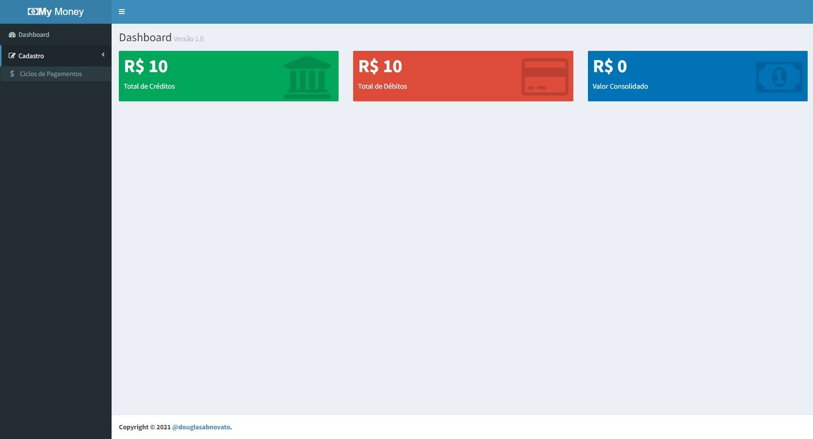
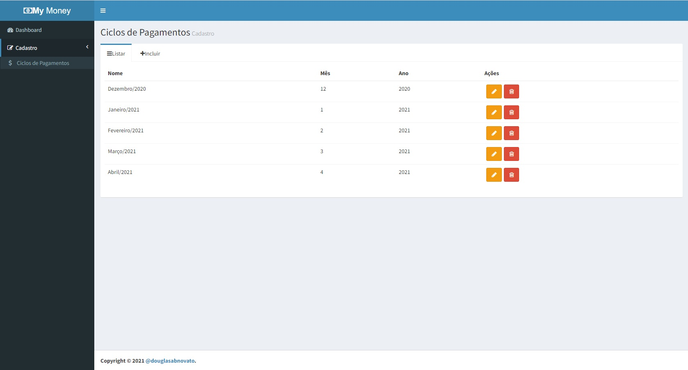
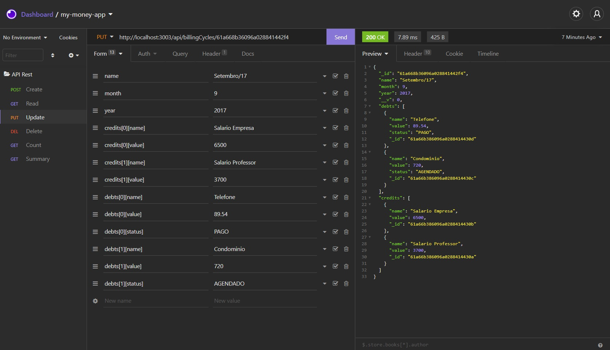
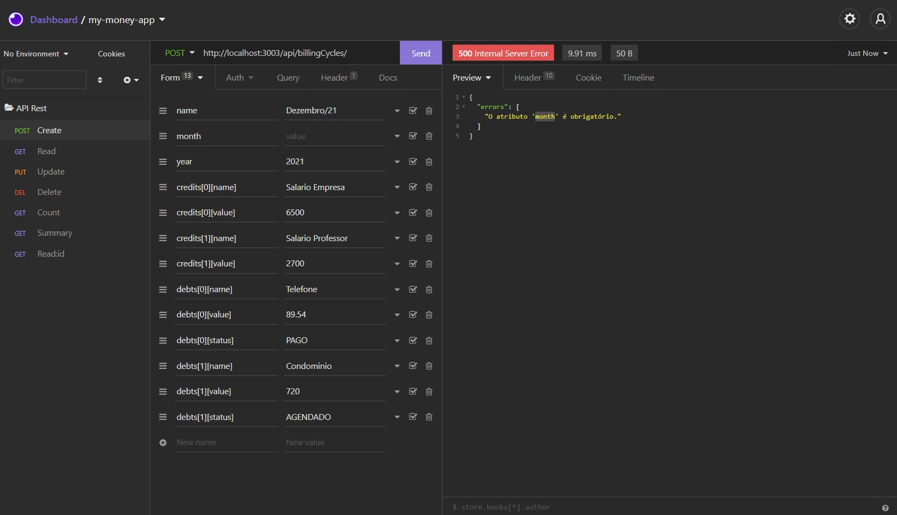
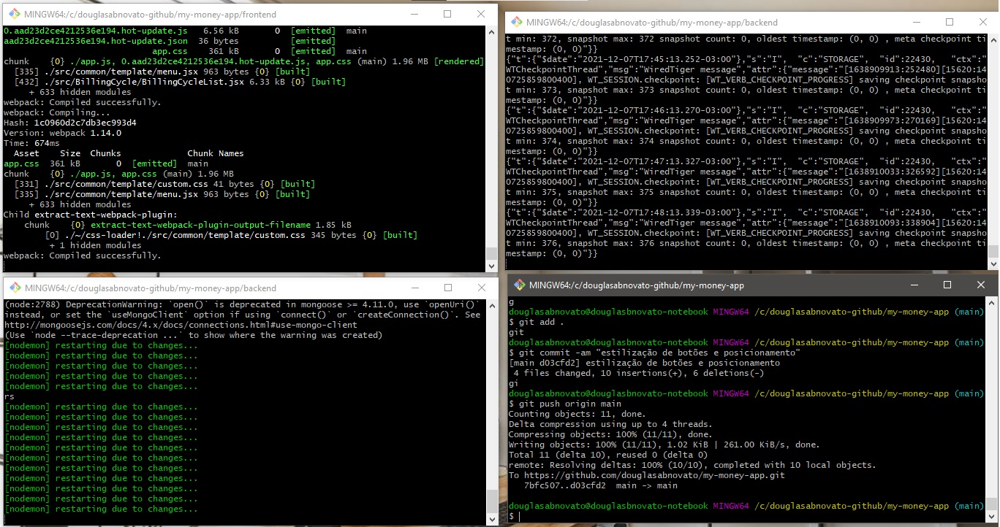

<h4 align="center"> 
	🚧 My Money App 🚧
</h4>   

 
  

 

## 💻 Tecnologias 🚀

Backend
- [x] 1. MongoDB
- [x] 2. Mongoose
- [x] 3. Node RestFull
- [x] 4. Express
- [x] 5. Node
- [x] 6. Postman/Insomnia

Frontend
- [x] 0. Html, css, javascript
- [x] 1. Bootstrap
- [x] 2. React - react-dom, react-router  
- [x] 3. Redux - react-redux, redux-form, redux-multi, redux-promise, redux-thunk, redux-toastr   
- [x] 4. Axios
- [x] 5. Lodash
- [x] 6. Redux DevTools
- [x] 7. Redux Form 
- [x] 8. Redux Toastr
- [x] 9. Redux Mult

## 🎨 Layout

 
   
  
   
     
   

 

## 🚀 Desafios 

- [x] Backend da aplicação de ciclos de pagamentos [189 - 203]  
- [x] Frontend da aplicação de ciclos de pagamentos [204 - 261] 
- [x] Melhorias e correções [262 - 265] 
- [x] Autenticação [backend] da aplicação de ciclos de pagamentos [264 - 275] 
- [x] Autenticação [frontend] da aplicação de ciclos de pagamentos [276 - 281] 
- [x] Atualização de dependências da aplicação de ciclos de pagamentos [282 - 283] 
- [ ] Deploy da aplicação de ciclos de pagamentos [284 - 286]

## 🚀 Inicializar o projeto 

#### Backend

- `git clone`: clonar
- Create file `package.json` with details.   
- Install the lib in the development mode: `npm i`   
- Run project in the development: `mongod`: subir o bd e `npm run dev`: startar o backend

#### Frontend

- Commands `mkdir frontend`. Create file `package.json` with details  
- Install the lib in the development mode: `npm i`   
- Run project in the development: `npm run dev` 
 
## 🚀 Construído projeto 

Backend - API Testando no Insomnia/Postman
- [x] 1. URL: /api/billingCycles, Método: GET, Operação: consultar todos os ciclos
- [x] 2. URL: /api/billingCycles/1, Método: GET, Operação: consultar o ciclo de ID = 1
- [x] 3. URL: /api/billingCycles, Método: POST, Operação: criar um novo ciclo 
- [x] 4. URL: /api/billingCycles/2, Método: PUT, Operação: alterar o ciclo de ID = 2
- [x] 5. URL: /api/billingCycles/3, Método: DELETE, Operação: remover o ciclo de ID = 3
- [x] 6. URL: /api/billingCycles/count, Método: GET, Operação: consultar a quantidade de ciclos
- [x] 7. URL: /api/billingCycles/summary, Método: GET, Operação: Consultar o sumário de ciclos
- [x] 8. Tratamento de Errors com mensagens personalizadas
- [x] 9. backend pm2: rodar:`npm run production`, monitorar:`./node_modules/.bin/pm2 monit`, situação: `./node_modules/.bin/pm2 status`, restartar: `./node_modules/.bin/pm2 update`, deletar: `./node_modules/.bin/pm2 delete my-money-backend`
- [x] autenticação

Frontend - Layout Responsivo
- [x] 1. Template  
- [x] 2. Font Awesome
- [x] 3. Páginas: dashboard, cadastro de ciclos de pagamentos 
- [x] 4. Estrutura da Aplicação: header, sidebar, menu, menutree, menuitem, footer  
- [x] 5. Navegação com react-router
- [x] 6. Integração do Dashboard com o Redux: atenção as chamadas assíncronas: `const store = applyMiddleware(promise)(createStore)(reducers)`
- [x] 7. Ciclo de vida Redux com middlewares
- [x] 8. middleware redux mult para o dispatch passar um array
- [x] 9. warning: mudado connect por createConnection
- [x] 10. restartar backend com o pm2
- [x] 11. componente creditList
- [x] 12. Responsividade do menu
- [x] 13. Navegação com o componente Link do `react-router`, mas decidi manter.
- [x] 14. Elemento de autenticação que determina se será exibido o auth ou o app
- [x] 15. atualizando projeto para `npm i -g create-react-app`, `npx create-react-app frontend`
- [ ] warning: TypeError: Cannot read properties of undefined (reading 'credit')
- [ ] warning: Unhandled Rejection (TypeError): Cannot read properties of undefined (reading 'credit')

## 📝 Licença

Este projeto esta sobe a licença MIT.

Feito com ❤️ por Douglas A B Novato 👋🏽 [Entre em contato!](https://www.linkedin.com/in/douglasabnovato/)
 
Fonte do projeto Por Leonardo Moura Leitão no [Curso React + Redux: Fundamentos e 2 Apps do Absoluto ZERO!](https://www.udemy.com/course/react-redux-pt/), [Cod3r](https://www.cod3r.com.br/), [Github Cod3r](https://github.com/cod3rcursos/next-crud)
