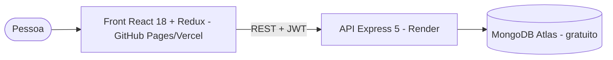
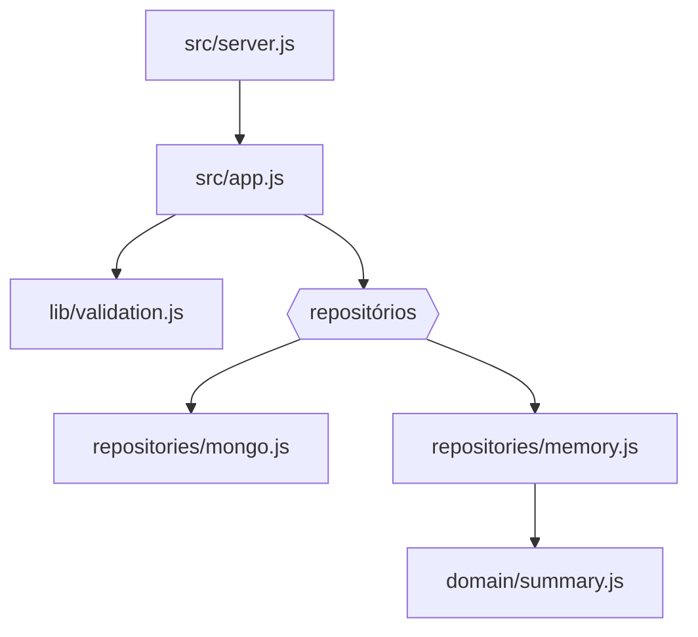

# Arquitetura — My Money App

## 1. C4

| Contêiner | Tecnologia |
|---|---|
| Front | React 18, Redux + redux-form, React Router 7 (HashRouter), AdminLTE 2 (só CSS), Vite |
| API | Node 20, Express 5, Mongoose 8, bcryptjs, jsonwebtoken, zod, helmet |
| Banco | MongoDB (Atlas M0) |

## 2. Modelo de dados

| Coleção | Campos | Regras |
|---|---|---|
| users | name, email (único, minúsculo), password (bcrypt, `select: false`) | — |
| billingcycles | **userId**, name, month 1–12, year, credits[{name, value}], debts[{name, value, status}] | índice `(userId, year, month)` |

## 3. Contratos

| Rota | Resposta |
|---|---|
| `POST /oapi/signup` | 201 `{ name, email, token }` · 400 · 409 |
| `POST /oapi/login` | 200 `{ name, email, token }` · 401 · 429 |
| `POST /oapi/validateToken` | `{ valid }` |
| `GET /api/billingCycles?skip&limit` | lista do usuário |
| `GET /api/billingCycles/count` · `/summary` | `{ value }` · `{ credit, debt, balance }` |
| `GET/PUT/DELETE /api/billingCycles/:id` | 200/204 · 404 (inclusive de outro usuário) |
| `POST /api/billingCycles` | 201 · 400 |

Cabeçalho: `Authorization: Bearer <token>` (o formato antigo, só o token, continua aceito).

## 4. ADRs

- **ADR-001 — Payload mínimo no JWT** (`sub`, `name`, `email`). Nunca serializar o documento do banco.
- **ADR-002 — Multilocação por `userId`.** Toda consulta filtra pelo dono; recurso de outro usuário responde 404 (não revela existência). Ciclos antigos sem dono são atribuídos com `npm run claim-orphans -- email`.
- **ADR-003 — Sair do node-restful.** Rotas explícitas mantêm o mesmo contrato do front e permitem validar com zod (400 em vez de 500).
- **ADR-004 — Repositórios injetáveis.** Mongo em produção; memória nos testes (o binário do MongoDB não pode ser baixado no ambiente de CI local) e em `MONGODB_URI=memory` para demonstração.
- **ADR-005 — Vite no lugar do react-scripts 1.x**, mantendo Redux/redux-form para preservar o código de aula; jQuery e JS do AdminLTE substituídos por React (menu, abas, dropdown).

## 5. Fora do escopo

Migrar para Redux Toolkit/React Hook Form, gráficos por mês, recuperação de senha.
